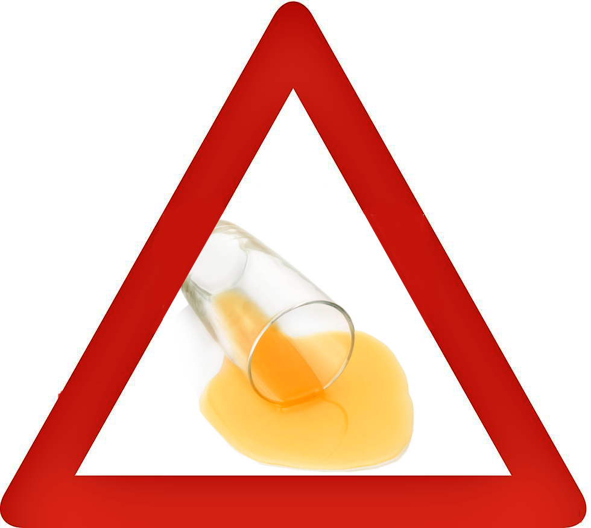
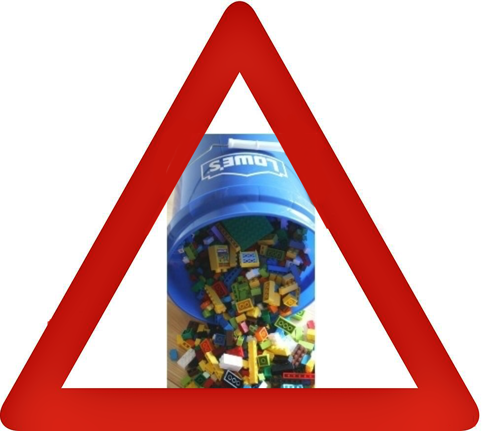
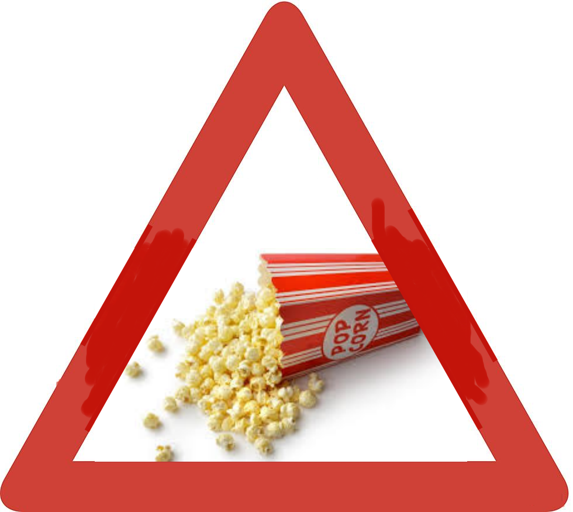

# Quicker Picker Upper
Quicker Picker Upper is a game that the player is in charge of taking care of the daycare.

There will be kids storming over time and your mission is to clean up their messes.

**There are total of four types of messes**
- Drawn on the wall
- Juice spill
- Toy spill
- Snack spill

These warning will appear when messes have been made in a particular room

.

.

**Using the proper tool you can clean up the messes.**
- Cloth will clean Drawn on the wall
- Sponge will clean Juice spill
- Basket will clean Toy spill
- Vaccuum will clean Snack spill

Over time number of kids will increase.
More kids means more messes!

*When a room has all four of the messes the game will be over!*

You better clench up and clean things up as fast as you can before too many kids storm
